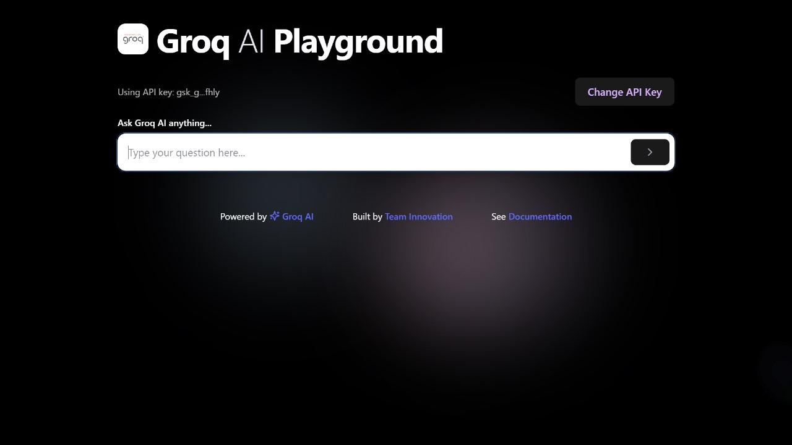

# 🚀 ReactGroq - AI-Powered Chat Interface


A lightning-fast AI chat application built with modern web technologies. Experience conversational AI with stunning animations and responsive design.

 

## ✨ Key Features

### 🚀 Performance Optimized
- **Vite-powered** build system for instant hot module replacement
- **SWC compiler** for fastest-in-class transpilation
- **Code splitting** for optimized loading

### 🎨 Beautiful UI/UX
- **Tailwind CSS** with custom design system
- **Framer Motion** for buttery-smooth animations
- **Dark/light mode** (coming soon!)
- **Fully responsive** across all devices

### 🤖 Advanced AI Integration
- **Groq Cloud** AI inference with ultra-low latency
- **Conversation history** management
- **Rate limiting** and error handling
- **Markdown support** in AI responses

### 🛠 Developer Experience
- **ESLint + Prettier** configured
- **Git hooks** via Husky
- **Component library** structure

## 🛠️ Getting Started

### 📋 Prerequisites

- Node.js 18+
- npm 9+ (or pnpm/yarn)
- Groq API key ([get one here](https://console.groq.com))

### ⚡ Quick Start

```bash
# Clone the repository
git clone https://github.com/vwzn/reactgroq.git
cd reactgroq

# Install dependencies
npm install  # or pnpm install / yarn

# Set up environment
cp .env.example .env
# Add your Groq API key to .env

# Start development server
npm run dev